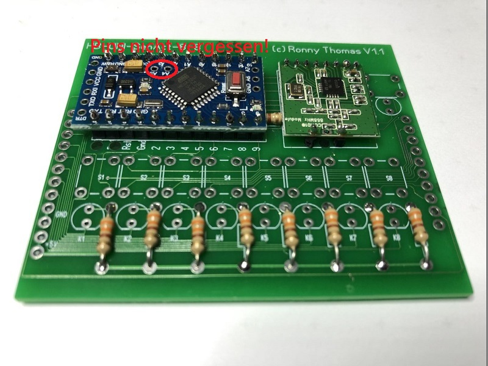

# HB-UNI-SenAct-8-8-Hutschine
## 8x 6A Schaltkontakte + 8 Eingänge 
## Spannungsversorgung 9-36V mit Internen Netzteil oder 5V

## benötigte Hardware
**Vorschlag Bauteile**
* 1x Arduino Pro Mini **ATmega328P (3.3V/8MHz)**
* 1x CC1101 Funkmodul **(868 MHz)**
* 1x FTDI Adapter (wird nur zum Flashen benötigt)

Meine Verwendetet Teile:[Reichelt](https://www.reichelt.de/my/1537601)  

[Kontakt via Facebook](https://www.facebook.com/ronny.thomas.83)

[Software](https://github.com/jp112sdl/HB-UNI-SenAct-8-8)

Controller-Platine:
Auf der oberen Platine zuerst die Widerstände bestücken. Danach die Stiftleisten für die Module einlöten.
Passend dazu die beiden Module einlöten (hierzu können die oberen Stiftleisten ein wenig gekürzt werden)
Dann die Taster einlöten, hierzu sollte man erst bei allen nur ein Pin anlöten und dann komplett ausrichten – es ist wichtig, das alle Taster gerade und in einer Linie fixiert werden !
Genauso verfahren wir mit den 5mm LED’s diese sollten auch erst mit einen Pin angelötet werden und dann ausgerichtet werden.
Die Antenne ist aber nicht zu vergessen, die durch die Platine „gefädelt“ wird und am Empfangsmodul mittig eingelötet wird. Dazu sind passende Bohrungen auf dem Board vorhanden.

Hauptplatine:
Die Diode und nach die Sockel für IC’s einlöten (Kann man auch ohne Sockel bestücken)
8x Kondensatoren einlöten dann die stehenden Bauteile (Widerstände ect.)
Immer erst die „kleinsten“ Bauteile zuerst, danach die größeren.
Hier sollte spätestens die Entscheidung fallen, ob ich mit 5V direkt einspeisen oder alternativ über das Schaltnetzteil gehen will.
Wenn dieses nicht genutzt wird, können dafür die Bauteile weggelassen werden.
Die Schraubklemmen (oder alternativ Wago) auflöten und dann die Relais. Die Leiterbahnen zu diesen sollte man noch extra verzinnen (bezüglich Strombelastung)

Jetzt kommen die beiden langen Stiftleisten die jeweils rechts und links auf der Hauptplatine zuerst angelötet werden.
Dann wird die Controllerplatine aufgesetzt und verlötet, hier können auch die Leisten gekürzt werden.
Den Aufkleber für die Frontplatte genau exakt platzieren. Am besten ist es, die Löcher mit einem 1mm HSS Bohrer erstmal mittig!!! vorzubohren. Anschließend kann man für die LEDs ein 5mm sowie für die Taster ein 2,5mm Bohrer vergrößern.

**Viel Spass bei Bauen**